# 수화닥터

### URL

https://수화닥터.site

### 발표 UCC

▶ https://www.youtube.com/watch?v=fhs5GLlKX7U

WebRTC로 환자와 의사를 연결하고 수화번역을 통해 농인의 진료를 도움

---

## ✔기획 의도

- 수어는 한국어를 손으로 표현하는 것이 아니며, "농인"은 수어를 제1언어로 사용하는 사람들을 의미합니다
- 농인분들은 의료시설 혹은 서비스를 이용할 때 원하는 시간에 자유롭게 수화통역사를 대동하는 것이 어렵습니다
- 이로 인해 불편함을 느꼈을 농인분들에게 이를 해소시켜드리기 위한 "배리어프리"를 목적으로 수화닥터는 기획되었습니다
- 

---

## ✔주요기능 (산출물)

### 일반회원가입

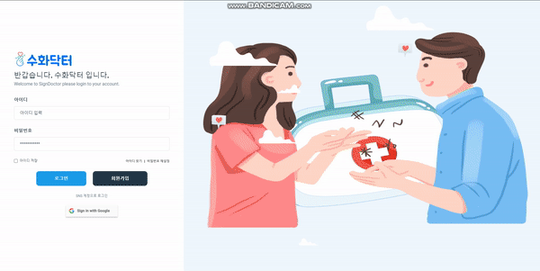

### 로그인


### 구글 간편로그인


### 예약 신청


### 예약 확인

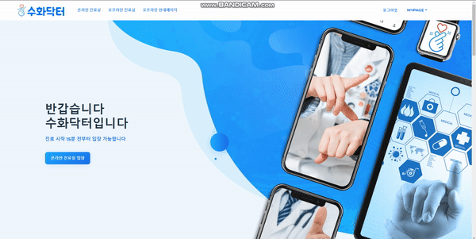

### 온라인 진료


### STT(Speech To Text)

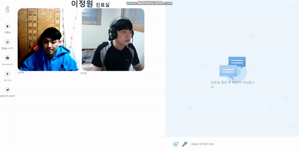

---

## ✔개발 환경

### ⚙AI, STT

- YOLOv5
- TensorFlow.js
- window.webkit Speech Recognition

### ⚙WebRTC

- OpenVidu

### ⚙BackEnd

- Java Spring
- JWT Authentication
- JPA DataBase

### ⚙FrontEnd

- Vue.js
- Nuxt.js
- SCSS

### ⚙CI/CD

- Service Architecture
- AWS
- Docker
- Jenkins
- Nginx

### ⚙PM

- Git
- Sourcetree
- Jira
- Notion
- Mattermost
- Webex
- Discord

---

## ✔와이어프레임

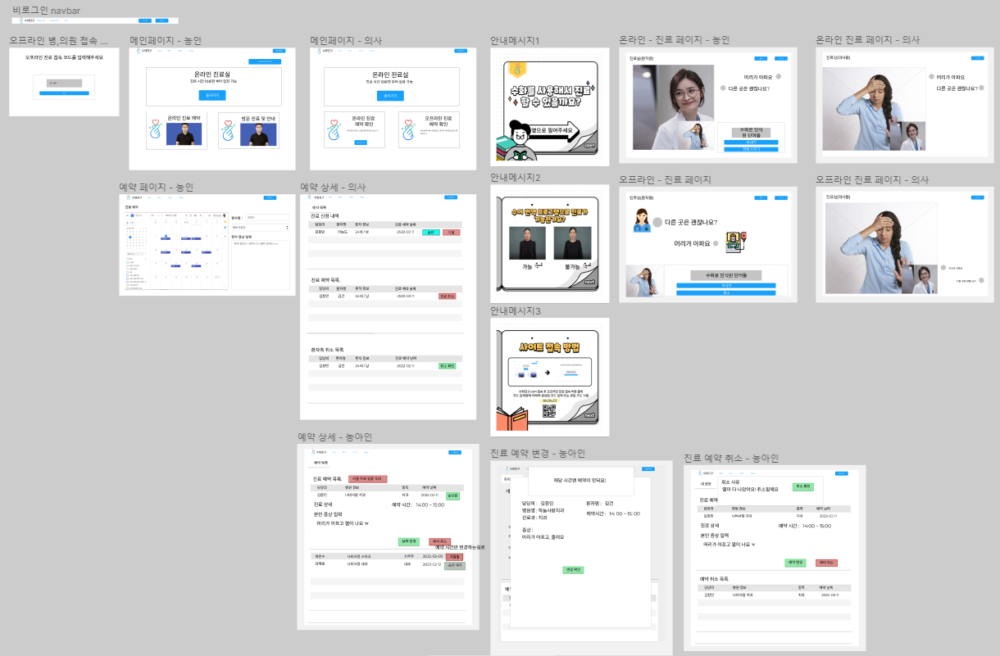

---

## ✔기능 명세서

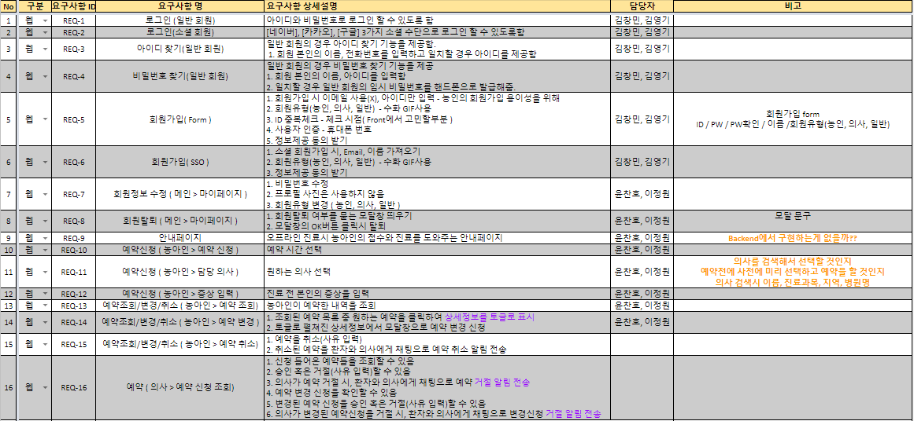


---

## ✔ERD

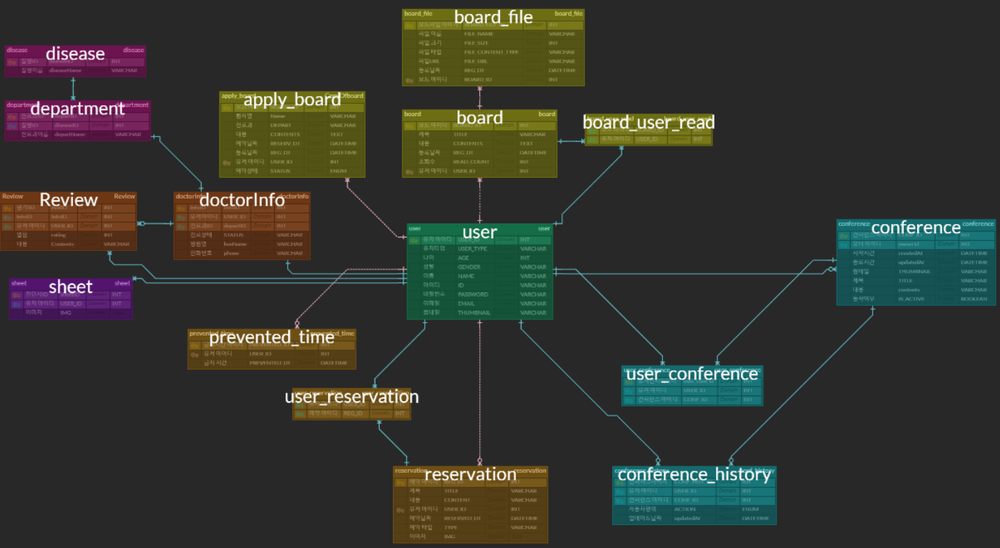

---

## ✔Git 컨벤션

```
feat : 기능 추가
fix : 버그 수정
docs : 문서 수정
chore : 자잘한 작업
test : 테스트
build : 외부 종속성에 영향을 미치는 변경사항(npm 등)
ci : CI관련
style : 코드 정리 (공백 등)
```

---

## ✔Git 브랜치 전략

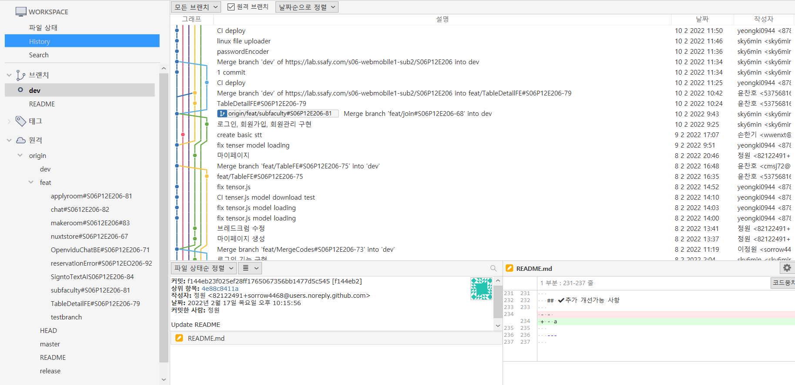

---

## ✔CI/CD

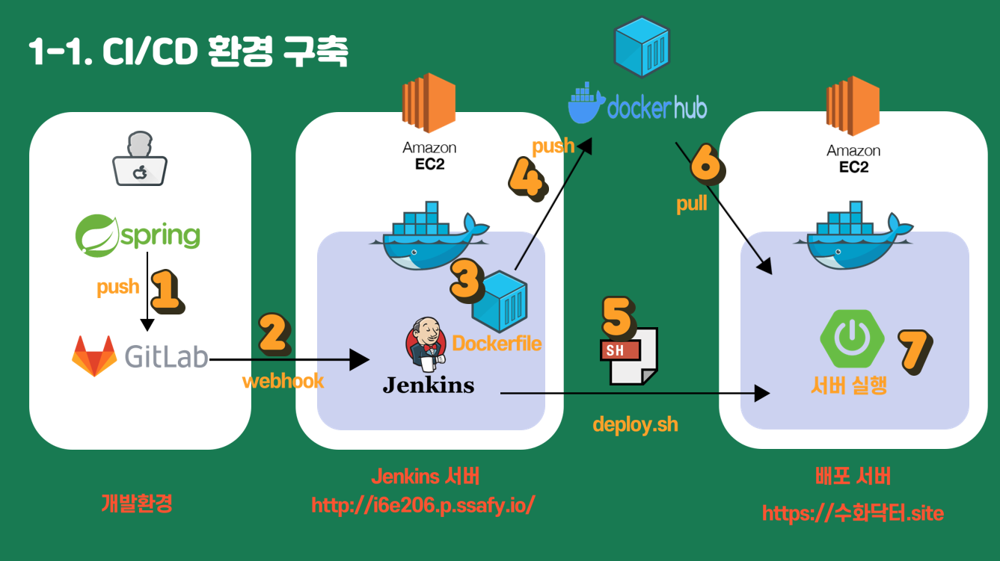

---

## ✔Notion

### Daily Scrum

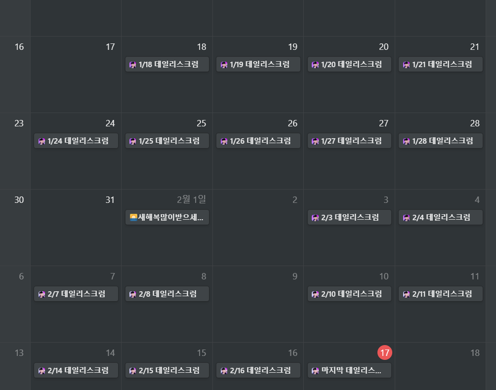

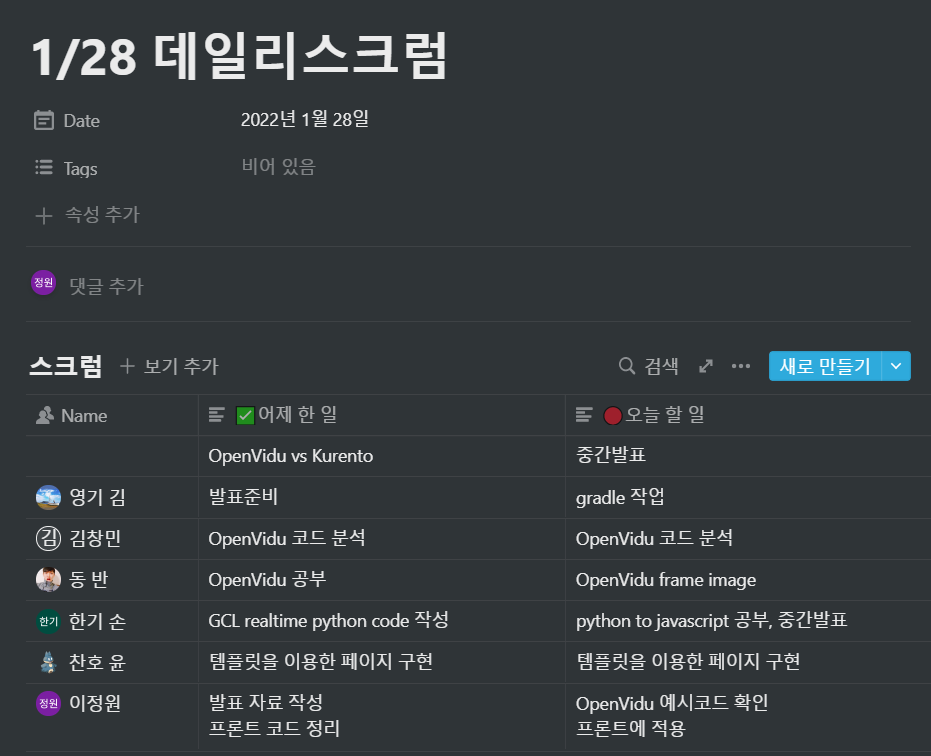

---

## ✔Jira

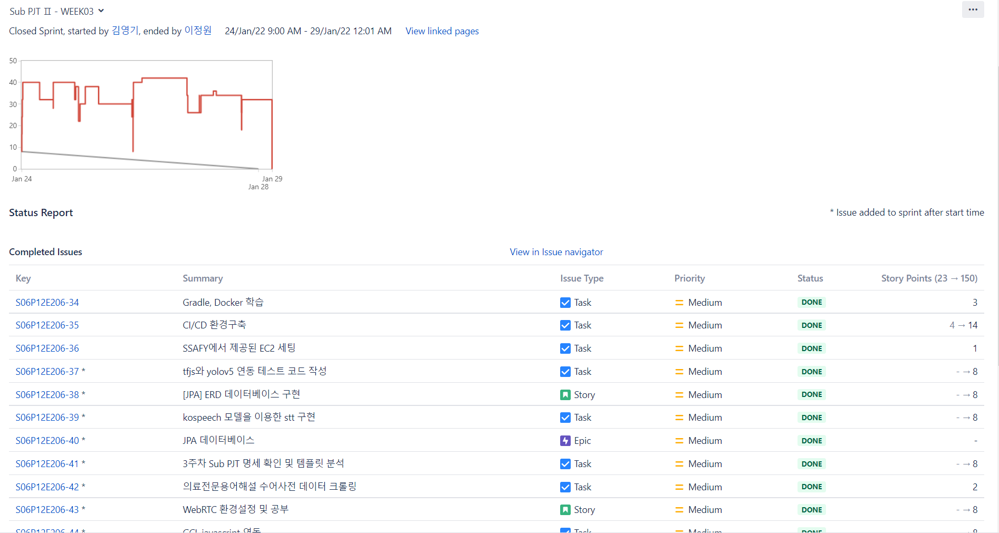

---

## ✔Discord

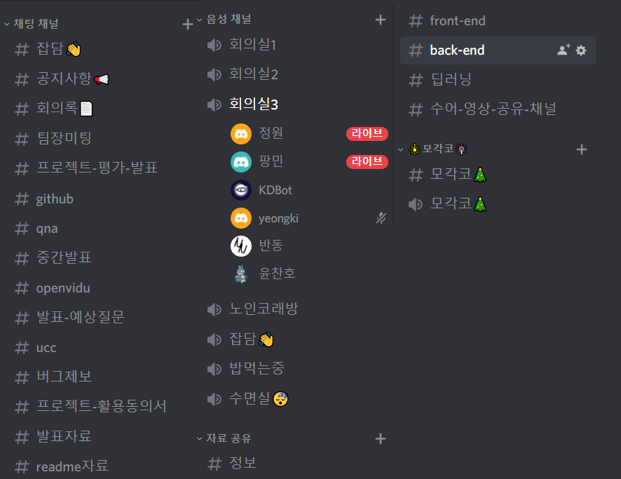

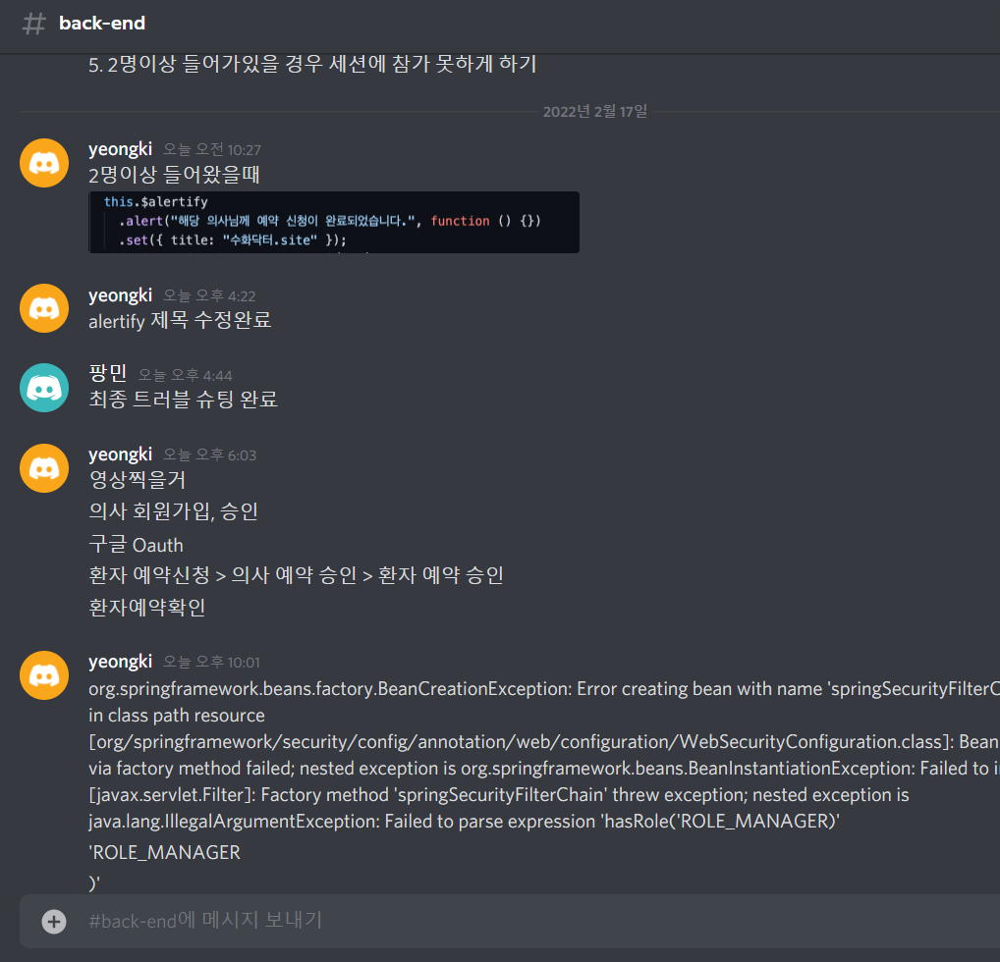

---

## ✔팀원 소개

- 김영기
  - BackEnd
  - CI / CD
  - OpenVidu
  - WebSocket

- 김창민
  - BackEnd
  - DB 설계
  - OpenVidu

- 반형동
  - AI 수화번역
  - FrontEnd

- 손한기
  - STT (Speech To Text)
  - 발표 PPT
  - FrontEnd

- 윤찬호
  - FrontEnd
  - 페이지 디자인

- 이정원
  - 팀장
  - FrontEnd
  - 페이지 디자인


---

## ✔회고록

- 김영기
  - 
- 김창민
  - 
- 반형동
  - 
- 손한기
  - 
- 윤찬호
  - 
- 이정원
  - 
